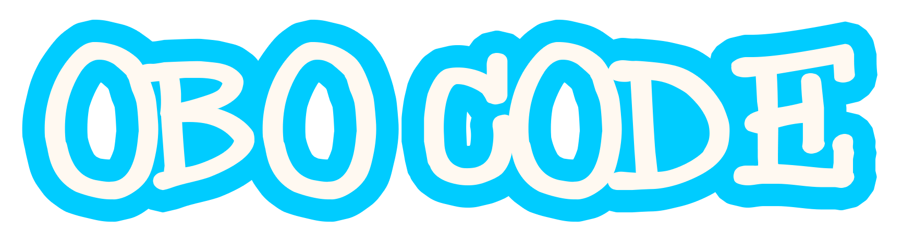

# Obo Code


**Python Interpreter for Turtle library using Skulpt**

## Introduction

Obo Code is an extention for [Obo Blocks](https://oboblocks.roboticgenacademy.com/) which can support graphical drawings using python turtle library. This tool enables users to run python turtle programs with graphical interface while realtime interpretation using [Skulpt](https://skulpt.org/).


## Features

1. **Client-side Python Interpreter** : Obo Code uses Skulpt to interpret Python code within the browser environment.
2. **Support for Python Turtle Library** : Obo Code supports Python Turtle Library for graphical drawings.
3. **Real-time Code Execution** : Users can run Python code and see the output in real-time.
4. **Code Editor** : Users can write Python code using a code editor with syntax highlighting.


### User Interfaces

Obo Code will use same user interfaces as Obo Blocks with additional components for turtle graphics.

- **Turtle Workspace**: Interface for graphical drawings using Python Turtle Library.
- **Python Code Editor**: Interface for writing Python code using [CodeMirror](https://codemirror.net/).
*   **Output Console**: Display execution output and errors when evaluating Python code.


## Installation

Clone this repository using the following command:

```bash
git clone https://github.com/RoboticGen/Obo-Code.git
```
Install dependencies:
```bash
npm install
```
Serve the frontend using:
```bash
npm run dev
```

## Usage

You can access the Obo Code platform by opening [Obo Code](https://obocode.roboticgenacademy.com/) in a web browser.

## Documentation

Here are the links to the documentation of Obo Code:

- [Software Requirements Specification](SRS.md)
- [System Design Document](SDD.md)


## Dependencies

- [Python](https://www.python.org/)
- [Skulpt](https://skulpt.org/)
- [Codemirror](https://codemirror.net/)


## Contributing

Pull requests are welcome. For major changes, please open an issue first to discuss what you would like to change.

## License

This project is under Roboticgen Academy. 


## Contributors

[@yasanthaniroshan](https://github.com/yasanthaniroshan)

