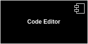
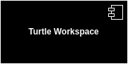
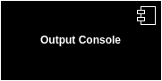
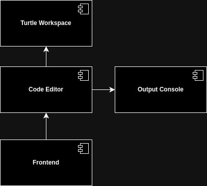
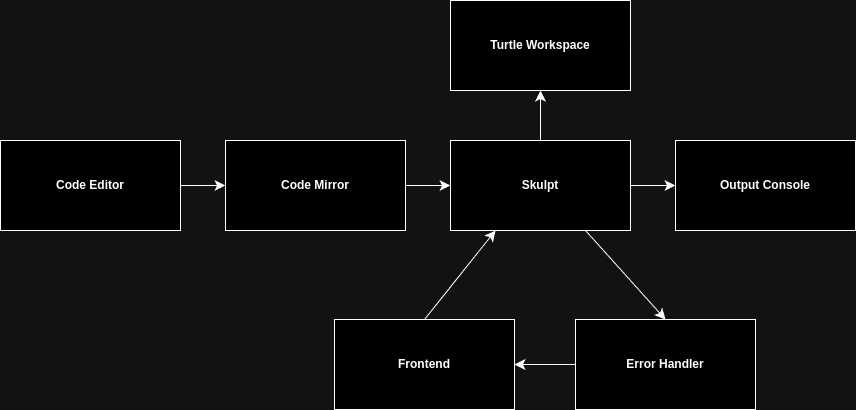
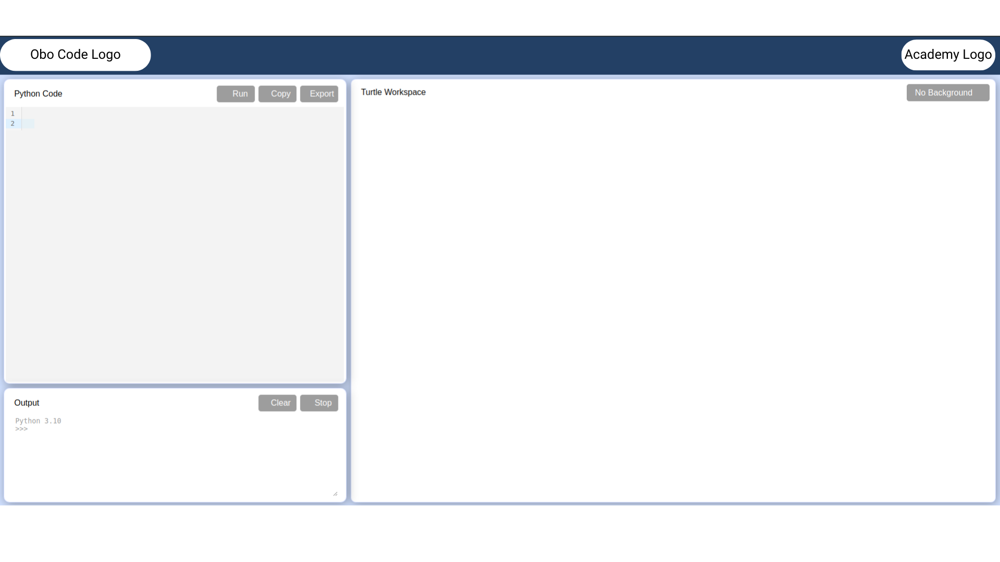

# **Software** **Design Document**

## Version

| Version | Date | Status |
| ---| ---| --- |
| 1.0 | 30/05/2024 | Approved |

## Reference

[Software Requirement Specification](SRS.md)

## Introduction

### Purpose

This document outlines the design and architecture of Obo Code, a extension for Obo Blocks to support interpreting python turtle library with graphics. Obo Code aims to simplify the process of running Python code with graphical output using the turtle library within the browser environment.

### Scope

Obo Code will provide a platform for users to write and execute Python code with graphical output using the turtle library. The platform will include a code editor, a turtle workspace, and an output console for displaying execution results. Obo Code will utilize Skulpt, a client-side Python interpreter, to run Python code within the browser environment.

## Design and Architecture

### System Overview

The system is for students and teachers who want to use python turtle library for graphical drawings. The system will provide a platform for users to write and execute Python code with graphical output using the turtle library. The platform will include a code editor, a turtle workspace, and an output console for displaying execution results. Obo Code will utilize Skulpt, a client-side Python interpreter, to run Python code within the browser environment.

### Architectural Style

The Monolithic Architecture will be used for the system.

### Components

*  **Code Editor** : Interface for writing Python code using [CodeMirror](https://codemirror.net/).

    

*  **Turtle Workspace** : Interface for graphical drawings using Python Turtle Library.
    
    

*  **Output Console** : Display execution output and errors when evaluating Python code.

    

#### Component Communication

- The components will communicate with each other as follows
    
     

### Data Flow

- The data flow in the system will be as follows

    1. User writes Python code in the code editor.
    2. The code editor sends the code to the Skulpt interpreter for evaluation.
    3. Skulpt interprets the code and sends the output to the output console.
    4. If there any graphical output, it will be displayed in the turtle workspace.
    5. If there any input required, it will be displayed in the frontend as input box.
    6. If there are any errors, they will be displayed in frontend as Alert.

        

## Technology Stack

The technology stack of Obo Code will be as follow

### Frontend Technologies

*   Programming Languages : HTML,CSS and JavaScript.

### External APIs and Services

*   Third-Party APIs: 
    - Skulpt
    - CodeMirror

### Development Tools and Utilities

*   IDE/Code Editor : VS Code
*   Version Control : Git/Github
*   Project Management : ClickUp

## Deployment

*  Deployment will be done on Cloudflare Pages.

## Interfaces

#### User Interface

#### 

## Dependencies

*   [Python](https://www.python.org/)
*   [Skulpt](https://skulpt.org/)
*   [CodeMirror](https://codemirror.net/)
*   [Turtle Library](https://docs.python.org/3/library/turtle.html)

  